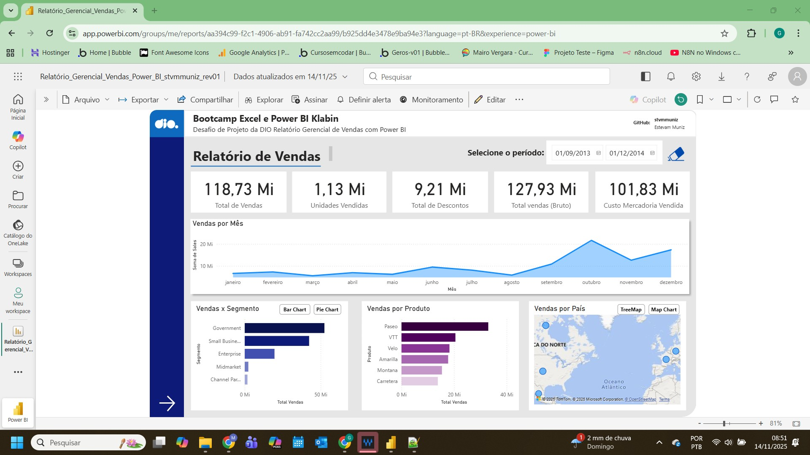
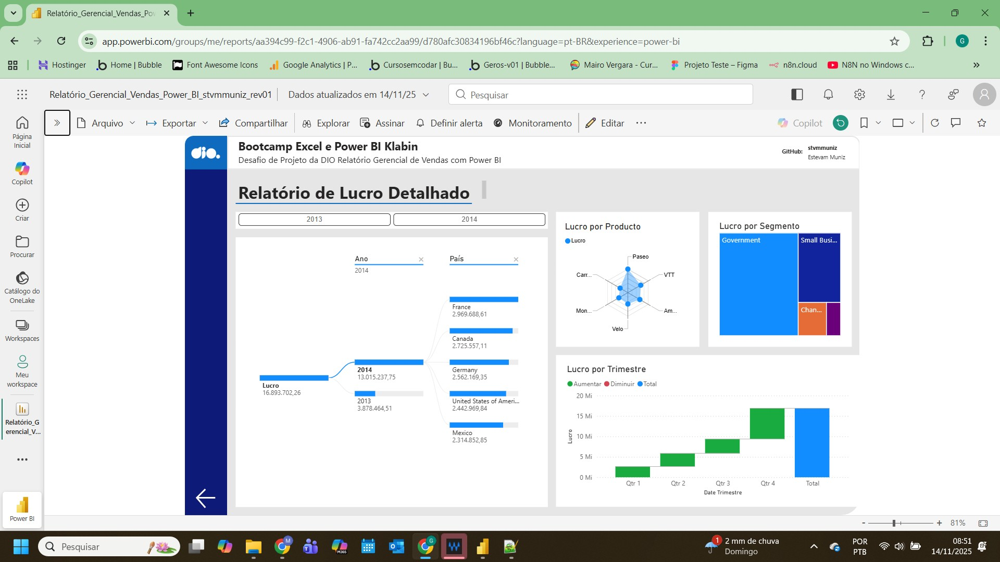

Este é um projeto prático de criação de um relatório de vendas no Power BI para atender ao Desafio de Projeto: Criando Um Relatório Gerencial de Vendas com Power BI, parte integrante o Bootcamp da Klabin - Excel e Power BI Dashboards.

## Contexto Inicial:

Criar relatório com visuais personalizados utilizando a base de dados de exemplo do Power BI (Financial Sample.xlsx).

## Atividades realizadas:
- [X] Criação da Página 1 - Relatório de Vendas, a partir do zero seguindo modelo apresentdo em aula:
    
    * Segmentação de dados por data;
	
	* Botão personalizado para Limpar a Segmentação de Dados

    * Visual utilizando Cards para mostrar Total de Vendas, Unidades Vendidas, Total de Desconto, Total de vendas (Bruto), Custo da Mercadoria Vendida (CMV);

    * Visual Vendas por Mês com Gráfico de Área;
	
	* Visual Vendas por Segmento com Gráfico de Barras e Gráfico Donut, oferecendo duas opções para visualização dos dados;
	
	* Botões personalizados para selecionar as opções de visualização entre Gráfico de Barras e Gráfico Donut;
	
	* Visual de Vendas por Produto com Gráfico de Barras;
	
	* Visual de Vendas por País com Gráfico de Mapa e Gráfico TreeMap, oferecendo duas opções para visualização dos dados;
	
	* Botões personalizados para selecionar as opções de visualização entre Gráfico de Mapa e Gráfico TreeMap;
	
	* Botão de Navegação para a Página 2.
	
- [X] Criação da Página 2 - Relatório de Lucro Detalhado, a partir do zero seguindo modelo apresentdo em aula:
    
    * Segmentação de dados por anos usando visual personalizado Chiclet Slicer;	
	
	* Visual de Lucro por Ano e País com Gráfico de Árvore Hierárquica;
	
	* Visual de Lucro por Produto com Gráfico Personalizado Radar Chart;
	
	* Visual de Lucro por Segmento com Gráfico TreeMap;
	
	* * Visual de Lucro por Trimestre com Gráfico de Cascata;
	
		

## Print do Relatório Publicado no Power BI Service:

- [X] Página 1: Relatório de Vendas

- [X] Página 2: Relatório de Lucro Detalhado

 
 
 
 
 ## Arquivos:
 
 - [X] Projeto Completo no Power BI: [Clique aqui para visualizar o arquivo.](Relatório_Gerencial_Vendas_Power_BI_stvmmuniz_rev01.pbix)
 

     
   
**Escrito por:** *stvmmuniz*
